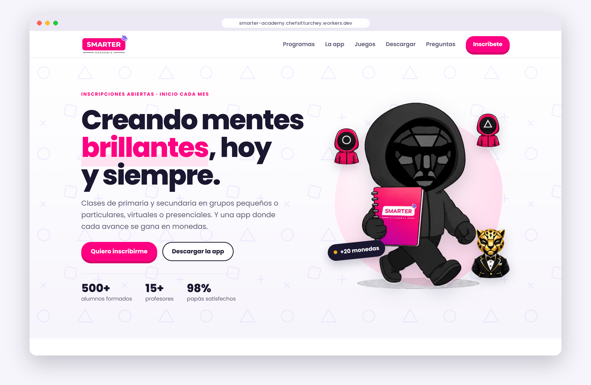

<div align="center">


### Creando mentes brillantes, hoy y siempre

Sitio web público de la Academia SMARTER: programas, inscripción por WhatsApp
y descarga de la app para alumnos y apoderados.

[](https://astro.build)
[](https://www.typescriptlang.org)
[](https://workers.cloudflare.com)
[](https://nodejs.org)

**[smarter-academy.chefsitturchey.workers.dev](https://smarter-academy.chefsitturchey.workers.dev)**

</div>

<br />

<p align="center">
  
</p>

<p align="center">
  
</p>

---

## Contenido

- [Qué incluye](#qué-incluye)
- [Tecnología](#tecnología)
- [Empezar](#empezar)
- [Estructura](#estructura)
- [Editar el contenido](#editar-el-contenido)
- [Imágenes](#imágenes)
- [Despliegue](#despliegue)
- [Publicar una versión de la app](#publicar-una-versión-de-la-app)
- [Próximos pasos](#próximos-pasos)

## Qué incluye

| Sección | Qué muestra |
| --- | --- |
| **Portada** | Mensaje principal, cifras de la academia y accesos a inscripción y descarga. |
| **Cómo empezar** | Los cuatro pasos de la consulta a la primera clase. |
| **Programas** | Círculo SMARTER, Ciclo Anual, Preparación para exámenes, Nivelación y reforzamiento, Avanzado y Clases particulares. |
| **La app** | Qué hace el alumno y qué hace el apoderado, con capturas reales de la app. |
| **Banco SMARTER** | Las cinco monedas (Círculo, Triángulo, Cuadrado, Jefe y VIPs) y la Tienda SMARTER. |
| **Juegos** | Ajedrez, Wordle, ranking y el resto de juegos de la app. |
| **Descarga** | APK para Android con código QR y guía de instalación en tres pasos. |
| **Inscripción** | Formulario que arma el mensaje y lo abre en WhatsApp. |
| **Testimonios y preguntas** | Opiniones de familias y respuestas a las dudas más comunes. |

Además:

- **Diseño adaptable:** pensado primero para el celular, que es desde donde llegan la mayoría de las familias.
- **Animaciones suaves** al bajar por la página, sin librerías externas. Respetan la opción de "reducir movimiento" del sistema.
- **Rápido:** HTML estático, imágenes convertidas a WebP al compilar y letra propia sin depender de Google Fonts.
- **Misma identidad que la app:** colores, letra (Poppins) y personajes.

## Tecnología

| | |
| --- | --- |
| Framework | [Astro 7](https://astro.build), salida estática |
| Lenguaje | TypeScript |
| Estilos | CSS propio con variables de diseño; sin frameworks de CSS |
| Imágenes | `astro:assets` (WebP y tamaños responsivos) |
| Código QR | [`qrcode`](https://www.npmjs.com/package/qrcode), generado al compilar |
| Hosting | Cloudflare Workers (archivos estáticos) |
| Descarga de la app | GitHub Releases |

## Empezar

Requisitos: **Node.js 22.12** o superior.

```sh
git clone https://github.com/chefsitturchey-web/LandingSmarter.git
cd LandingSmarter
npm install
npm run dev
```

El sitio queda en `http://localhost:4321` y se actualiza solo al guardar.

| Comando | Qué hace |
| --- | --- |
| `npm run dev` | Servidor de desarrollo con recarga en vivo |
| `npm run build` | Compila el sitio a `dist/` |
| `npm run preview` | Sirve `dist/` para revisar la versión compilada |

## Estructura

```text
├── docs/                    Imágenes de este README
├── public/                  Archivos que se sirven tal cual (fuentes, favicon)
├── scripts/
│   └── preparar_imagenes.py Genera las imágenes a partir del arte de la app
├── src/
│   ├── assets/img/          Imágenes del sitio (se optimizan al compilar)
│   ├── components/          Una sección de la página por archivo
│   ├── data/site.ts         Todo el texto y los datos del sitio
│   ├── layouts/Base.astro   Estructura común: head, barra y pie
│   ├── lib/                 Animaciones y utilidades
│   ├── pages/index.astro    La página principal
│   └── styles/global.css    Colores, letra y estilos compartidos
├── astro.config.mjs
└── wrangler.jsonc           Configuración de Cloudflare
```

## Editar el contenido

Todo el texto vive en **`src/data/site.ts`**. Cambiar un teléfono, un programa
o una pregunta frecuente es editar ese archivo; los componentes no se tocan.

| Qué | Dónde |
| --- | --- |
| Teléfono, correo, ciudad, WhatsApp | `academia` |
| Enlace y versión del APK | `app` |
| Programas | `programas` |
| Monedas del Banco SMARTER | `monedas` |
| Juegos y capturas | `juegos` |
| Testimonios | `testimonios` |
| Preguntas frecuentes | `preguntas` |
| Colores y tipografía | `src/styles/global.css` |

> [!IMPORTANT]
> Los datos marcados con `EJEMPLO` en `site.ts` (teléfono, cifras y
> testimonios) son de muestra y deben reemplazarse por los reales antes del
> lanzamiento.

## Imágenes

Las imágenes salen del arte de la app y del prototipo, no se editan a mano:

```sh
python scripts/preparar_imagenes.py
```

El script recorta las poses de la mascota, arma los jugadores con las piezas de
la Tienda SMARTER y copia monedas, stickers y medallas a `src/assets/img/`.
Necesita Python 3 con Pillow, y las carpetas de la app y del prototipo junto a
este repositorio.

Las capturas de pantalla de la app (`app-*.png`) se generan desde la app móvil.

## Despliegue

El sitio está publicado en **Cloudflare Workers** (proyecto `smarter-academy`),
conectado a este repositorio.

Cada `git push` a `main` lo vuelve a publicar automáticamente:

1. Cloudflare ejecuta `npm run build`.
2. Luego `npx wrangler deploy` sube el contenido de `dist/` según `wrangler.jsonc`.

> [!NOTE]
> El campo `name` de `wrangler.jsonc` debe coincidir con el nombre del proyecto
> en Cloudflare.

**Dominio propio.** En el proyecto de Cloudflare: *Domains → Add Domain*.
Después, actualiza `site` en `astro.config.mjs` y `academia.url` en
`src/data/site.ts`.

## Publicar una versión de la app

El APK pesa unos 27 MB y Cloudflare no sirve archivos de más de 25 MB, así que
se distribuye desde **GitHub Releases**:

1. En la app: `flutter build apk --release`.
2. Renombra `build/app/outputs/flutter-apk/app-release.apk` a `smarter.apk`.
3. En GitHub: *Releases → Draft a new release*, crea una etiqueta nueva
   (por ejemplo `v1.0.1`) y adjunta `smarter.apk`.

El botón de descarga apunta a `releases/latest/download/smarter.apk`, así que
siempre entrega la última versión sin tocar el sitio. El repositorio de las
Releases debe ser público. Para mostrar el número de versión nuevo, actualiza
`app.version` en `src/data/site.ts`.

## Próximos pasos

- [ ] Reemplazar los datos de ejemplo por los reales
- [ ] Publicar el APK en GitHub Releases y enlazarlo en `app.apk`
- [ ] Sección de materiales gratuitos (PDF)
- [ ] Dominio propio
- [ ] Versión de la app para iPhone

Para agregar una página nueva, crea `src/pages/<nombre>.astro` usando el layout
`Base`: la barra de navegación y el pie ya vienen incluidos.

---

<div align="center">

**Academia SMARTER** · Puno, Perú

</div>
